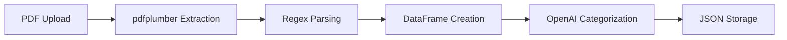
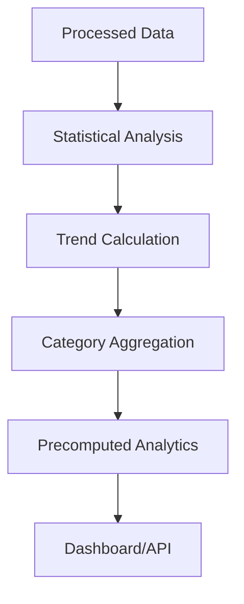
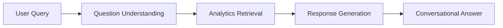

# Expense Navigator

An AI-powered financial analysis tool that transforms bank statements into actionable insights using machine learning and natural language processing.

## 🚀 Quick Start

> **Python Version:** 3.10

```bash
# Create virtual environment
python3.10 -m venv myvenv
source myvenv/bin/activate  # On Windows: myvenv\Scripts\activate

# Install dependencies
pip install -r requirements.txt

# Run the application
cd backend
uvicorn main_api:app --reload
```

Visit `http://localhost:8000` to access the application.

## 📁 Project Structure

```
expense-navigator/
├── backend/
│   ├── main_api.py              # FastAPI main application
│   ├── main_script.py           # Alternative entry point
│   ├── .env                     # Environment variables
│   ├── api/                     # API route modules
│   │   ├── __init__.py
│   │   ├── routes_pipeline.py   # PDF processing & analysis endpoints
│   │   ├── faq.py              # Financial analysis endpoints
│   │   └── chatbot_routes.py   # RAG chatbot endpoints
│   ├── core/                   # Core business logic
│   │   ├── __init__.py
│   │   ├── rag_chatbot.py      # RAG chatbot implementation
│   │   ├── categorizer.py      # ML transaction categorization
│   │   ├── table_extractor.py  # PDF table extraction
│   │   ├── faq.py              # FAQ processing logic
│   │   └── spending_summary.py # Financial summary calculations
│   └── data/                   # Data storage
│       ├── raw/                # Uploaded PDF files
│       └── processed/          # Processed transaction data (JSON)
├── frontend/
│   ├── templates/              # HTML templates
│   │   ├── index.html          # Main upload page
│   │   ├── about.html          # Project information
│   │   ├── dashboard.html      # Analytics dashboard
│   │   └── chatbot.html        # AI chat interface
│   └── static/                 # Static assets
│       ├── css/                # Stylesheets
│       │   ├── styles.css      # Main styles
│       │   ├── dashboard.css   # Dashboard-specific styles
│       │   └── chatbot.css     # Chatbot-specific styles
│       ├── js/                 # JavaScript files
│       │   ├── scripts.js      # Main functionality
│       │   ├── dashboard.js    # Dashboard interactions
│       │   └── chatbot.js      # Chat interface
│       └── video/              # Background videos
│           ├── background.mp4  # Default background
│           └── cash.mp4        # Alternative background
├── .gitignore                  # Git ignore rules
├── requirements.txt            # Python dependencies
└── README.md                   # Project documentation
```

## 🔧 Core Components

### Main API (`main_api.py`)

The central FastAPI application that:

- **Title**: "Transaction Tracker APIs" - Extracts, categorizes, and analyzes bank statements
- **HTML Routes**: `/` (home), `/about`, `/dashboard`, `/chatbot` with cache-busting timestamps
- **Data Route**: `/data/processed/categorized_transactions.json` - Serves processed transaction data
- **Utility Routes**: `/health` (health check), `/api-info` (API documentation), `/refresh-data` (clear processed data)
- **Middleware**: CORS enabled for cross-origin requests, custom static file serving with no-cache headers
- **Startup/Shutdown**: Automatic data directory creation and logging

### API Modules

#### 1. Pipeline Routes (`api/routes_pipeline.py`)

Handles PDF processing and data pipeline:

- `POST /pipeline/run-pipeline` - Upload PDF, extract tables using pdfplumber, and categorize transactions
- Uses `table_extractor.py` to extract transaction data from bank statement PDFs
- Uses `categorizer.py` for OpenAI-powered transaction categorization
- Saves processed data to `data/processed/categorized_transactions.json`

#### 2. FAQ Routes (`api/faq.py`)

Provides comprehensive financial analysis endpoints:

- `GET /faq/get-answers` - Generate complete financial Q&A analysis with all metrics
- `GET /faq/total-spending` - Calculate total expenses (withdrawals/debits)
- `GET /faq/total-income` - Calculate total income (deposits/credits)
- `GET /faq/highest-expense` - Find largest single transaction
- `GET /faq/highest-category` - Identify top spending category with amount
- `GET /faq/category-spending` - Category-wise spending breakdown
- `GET /faq/summary` - Complete financial summary with profit/loss analysis

#### 3. Chatbot Routes (`api/chatbot_routes.py`)

RAG-powered conversational interface:

- `POST /api/chatbot/chat` - Process natural language queries about finances
- `GET /api/chatbot/analytics` - Retrieve precomputed analytics and statistics
- `GET /api/chatbot/status` - Check data availability and transaction count
- `POST /api/chatbot/reload-data` - Refresh transaction data and reset chatbot instance

### Core Scripts

#### RAG Chatbot (`core/rag_chatbot.py`)

- **Purpose**: Intelligent conversational interface for financial queries
- **Features**:
  - Natural language understanding
  - Context-aware responses
  - Precomputed analytics for fast retrieval
  - Transaction pattern recognition
- **Key Methods**:
  - `understand_question()` - Intent classification
  - `generate_response()` - Context-aware answer generation
  - `compute_analytics()` - Statistical analysis

#### Table Extractor (`core/table_extractor.py`)

- **Purpose**: Extract transaction data from bank statement PDFs using pdfplumber
- **Key Function**: `extract_pdf_to_json(pdf_path)` - Main extraction function
- **Features**:
  - Regex-based date pattern matching (`\d{2}-\d{2}-\d{4}`)
  - Amount extraction with Dr/Cr identification
  - Narration text parsing between date and amounts
  - Returns structured DataFrame with Date, Narration, Withdrawal(Dr), Deposit(Cr), Balance

#### Categorizer (`core/categorizer.py`)

- **Purpose**: OpenAI-powered transaction categorization using GPT models
- **Key Class**: `BatchTransactionCategorizer` - Handles OpenAI API integration
- **Categories**: Food & Dining, Transportation, Shopping, Healthcare, Entertainment, Utilities & Bills, Financial Services, Personal Care, Education, Transfer/Refund, Miscellaneous
- **Features**:
  - OpenAI API v1.0+ and v0.x compatibility
  - Batch processing of transactions
  - Environment variable configuration (.env file)

#### FAQ Processor (`core/faq.py`)

- **Purpose**: Financial analysis and question answering system
- **Key Class**: `FinancialAnalyzer` - Core analysis engine
- **Functions**:
  - `ask_total_spending()`, `ask_total_income()`, `ask_highest_single_expense()`
  - `ask_highest_spending_category()`, `ask_category_spending()`
  - `generate_financial_qa_json()` - Complete Q&A generation

#### Spending Summary (`core/spending_summary.py`)

- **Purpose**: Generate comprehensive financial summaries and calculations
- **Features**:
  - Total spending/income calculations from transaction data
  - Category-wise aggregations and breakdowns
  - Net balance change calculations
  - Transaction count analysis by type

## 🔄 How It Works

### 1. Data Upload & Processing



1. **Upload**: User uploads PDF bank statement via `/pipeline/run-pipeline` endpoint
2. **Extraction**: `table_extractor.py` uses pdfplumber to extract text from each page
3. **Parsing**: Regex patterns identify dates (`\d{2}-\d{2}-\d{4}`), amounts, and narrations
4. **Structuring**: Data organized into DataFrame with Date, Narration, Withdrawal(Dr), Deposit(Cr), Balance
5. **Categorization**: `categorizer.py` uses OpenAI API to classify transactions into 11 categories
6. **Storage**: Final categorized data saved as `categorized_transactions.json`

### 2. Analytics Generation



- **Real-time Analysis**: On-demand calculations for dashboard
- **Precomputed Metrics**: Cached analytics for chatbot responses
- **Trend Detection**: Monthly/category-wise pattern identification

### 3. RAG Chatbot Workflow



1. **Query Processing**: `understand_question()` analyzes user input for financial intent
2. **Relevance Check**: `is_transaction_related()` validates if query is finance-related
3. **Data Retrieval**: Access precomputed analytics (totals, categories, trends) from DataFrame
4. **Response Generation**: `generate_response()` creates contextual answers using transaction data
5. **Delivery**: Return natural language response with specific financial insights and calculations

### 4. Frontend Architecture

#### Pages & Functionality

- **Index (`index.html`)**: Upload interface with drag-drop functionality
- **About (`about.html`)**: Project information and workflow explanation
- **Dashboard (`dashboard.html`)**: Interactive charts and visualizations
- **Chatbot (`chatbot.html`)**: Conversational AI interface with real-time chat

#### JavaScript Modules

- **`scripts.js`**: Upload handling, form validation, API communication
- **`chatbot.js`**: Chat interface, message handling, real-time updates
- **Chart integration**: Dynamic visualization of financial data

## 🛠️ Technology Stack

### Backend

- **FastAPI**: High-performance web framework with automatic API documentation
- **Python 3.10**: Core programming language
- **Pandas**: DataFrame operations for transaction data manipulation
- **pdfplumber**: PDF text extraction and table detection
- **OpenAI API**: GPT-powered transaction categorization
- **Uvicorn**: ASGI server for FastAPI application

### Frontend

- **HTML5/CSS3**: Modern web standards with responsive design
- **JavaScript (ES6+)**: Interactive functionality and API communication
- **Chart.js**: Data visualization for dashboard analytics
- **Jinja2 Templates**: Server-side HTML templating

### AI/ML Components

- **OpenAI GPT Models**: Transaction categorization and classification
- **Regex Pattern Matching**: Date and amount extraction from PDFs
- **RAG (Retrieval-Augmented Generation)**: Context-aware chatbot responses
- **Statistical Analysis**: Financial calculations and trend analysis

## 📊 API Documentation

Once running, visit:

- **Swagger UI**: `http://localhost:8000/docs`

## 🔒 Security & Privacy

- **Local Processing**: All data processed locally, no external API calls
- **Temporary Storage**: Uploaded files can be cleared anytime
- **No Permanent Storage**: Financial data not stored permanently
- **CORS Protection**: Configured for secure cross-origin requests

## 🚀 Features

- ✅ **PDF Processing**: Automatic bank statement parsing
- ✅ **ML Categorization**: Intelligent expense classification
- ✅ **Interactive Dashboard**: Visual analytics and charts
- ✅ **RAG Chatbot**: Natural language financial queries
- ✅ **Real-time Analysis**: Instant insights and calculations
- ✅ **Responsive Design**: Works on all devices
- ✅ **Data Privacy**: Local processing, no data sharing
